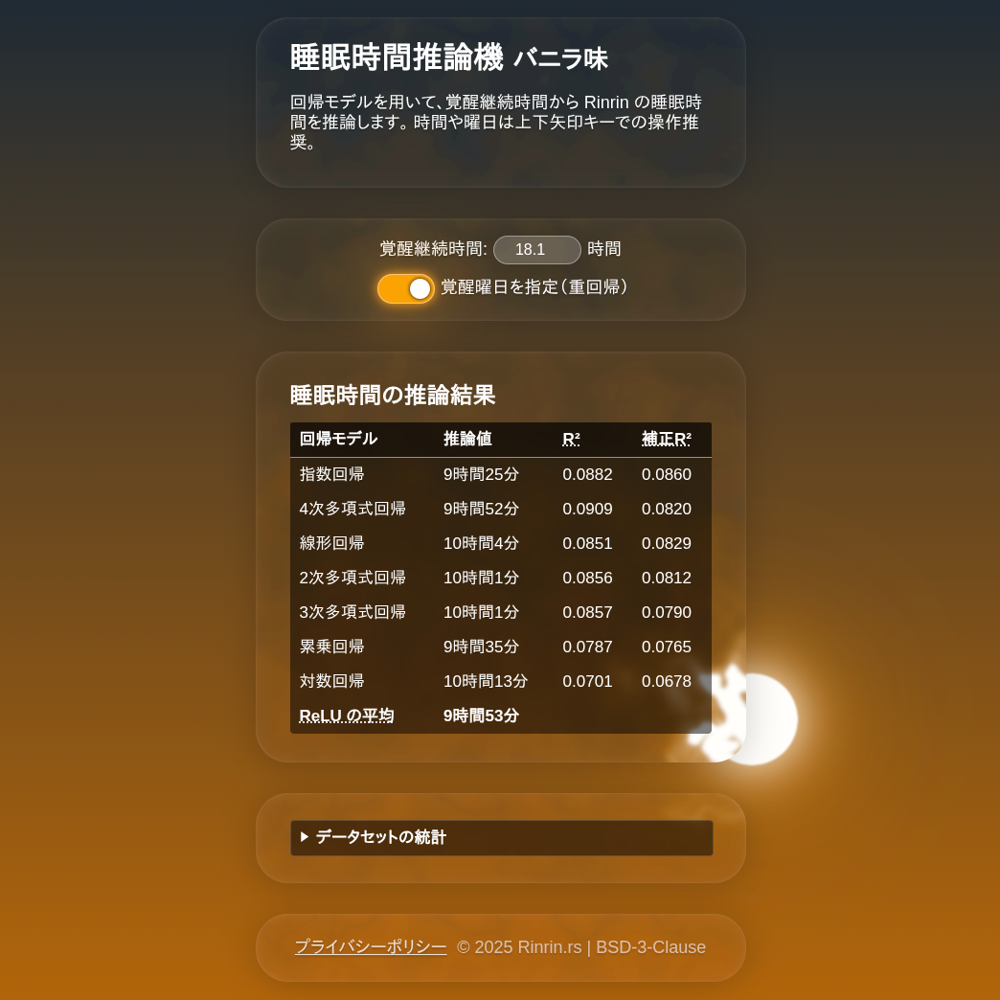

<h1 align="center">awake2sleep-inferencer-vanilla</h1>

	
	 
	<a href="https://awake2sleep-inferencer-vanilla.pages.dev">https://awake2sleep-inferencer-vanilla.pages.dev</a>

	Infers Rinrin's sleep duration from wakefulness duration using regression models. 
	This website was made with vanilla HTML, CSS, and JavaScript,
	without any frameworks or libraries.

 

	

