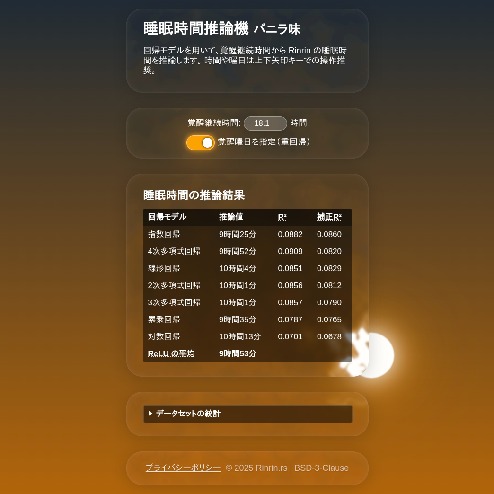

<h1 align="center">awake2sleep-inferencer-vanilla</h1>

	
	 
	<a href="https://awake2sleep-inferencer-vanilla.pages.dev">https://awake2sleep-inferencer-vanilla.pages.dev</a>

	Infers Rinrin's sleep duration from wakefulness duration using regression models.
	This website was made with vanilla HTML, CSS, and JavaScript,
	without any frameworks or libraries.

	*For the best experience,
	I recommend using the latest version of Google Chrome.

<h2 align="center">Site Map</h2>

	<a href="https://awake2sleep-inferencer-vanilla.pages.dev">Home</a> &middot;
	<a href="https://awake2sleep-inferencer-vanilla.pages.dev/privacy">Privacy Policy</a> &middot;
	<a href="https://awake2sleep-inferencer-vanilla.pages.dev/tests/simple-tester.html">Simple Tester</a>

<h2 align="center">License</h2>

The source code in this repository is licensed under the **BSD 3-Clause "New" or "Revised" License**.
The full license text is available in the [`LICENSE`](./LICENSE) file.

### Scope of the License

The BSD 3-Clause License applies to the original software source code (e.g., `*.html`, `*.css`, and `*.js` files).

It **does not apply** to the following:

#### 1. Rinrin.rs' Proprietary Assets

- All original content created by Rinrin.rs, including text, images, datasets, and other media assets.

All rights to these materials are reserved by Rinrin.rs and are not granted under the BSD 3-Clause License.

#### 2. Third-Party Assets

At present, this repository does not include any third-party libraries
or third-party media assets.

#### 3. Reused Material from Another Rinrin.rs Work

[`scripts/script.js`](./scripts/script.js) contains selected color values adapted from [Tempest Shaders for JE](https://github.com/Rinrin0413/Tempest-Shaders_JE/blob/84c26645b2ecfd6c169182fb4069c105476fdc68/shaders/lib/utils/colors.glsl) by Rinrin.rs, licensed under [CC BY 4.0](https://creativecommons.org/licenses/by/4.0/).

 

	

